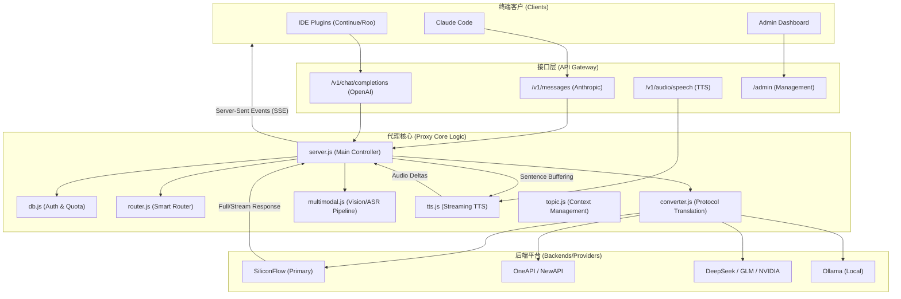

# Code Plan Proxy Architecture

This diagram illustrates the high-level architecture and data flow of the Code Plan Proxy.

## 核心模块职责

1.  **API Gateway**: 同时兼容 Anthropic 和 OpenAI 协议，支持流式和非流式模型请求。
2.  **Smart Router**: 根据用户意图（代码生成、深度推理、简单对话）自动选择最匹配的后端模型（如 Qwen2.5-Coder vs DeepSeek-R1）。
3.  **Protocol Converter**: 将 Anthropic 的消息格式转换为各家厂商通用的 OpenAI 格式，反之亦然。支持 `tool_use`、`thinking` 等高级特性转换。
4.  **Pseudo-Multimodal Pipeline**: 离线/在线多模态桥接器。将图片通过视觉模型转为文字描述，将语音通过 ASR 转为文本后再发给普通 LLM，实现“万物皆可多模态”。
5.  **Streaming TTS**: 实现标准 OpenAI 低延迟流式语音输出。拦截 LLM 的生成流，按句子粒度异步合成音频包，嵌入 SSE 流中返回。
6.  **Admin System**: 内置轻量级文件数据库，支持多用户 Key 管理、Token 额度控制及可视化用量统计。
